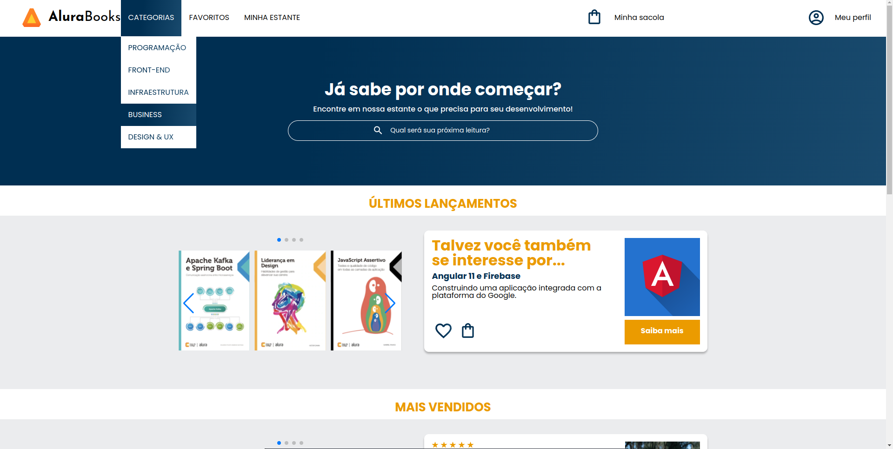
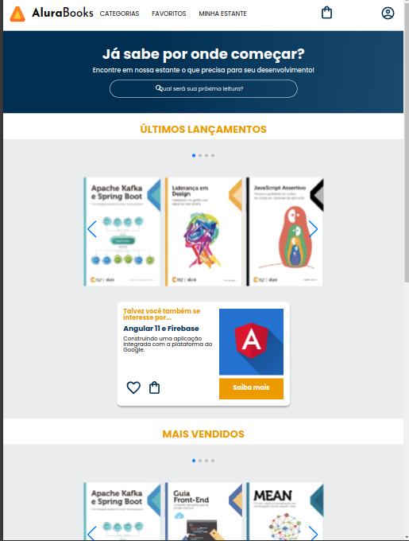
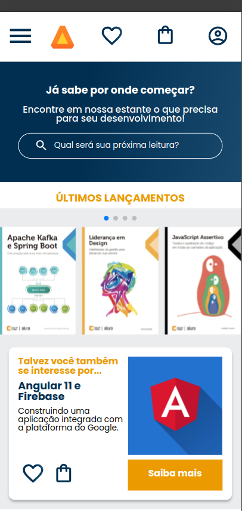

<h1> AluraBooks - Projeto feito na plataforma Alura.</h1>
Foi desenvolvido com o intuito de praticar conhecimentos sobre Responsividade Web.

Visualize a página por aqui: 
https://iambel.github.io/alurabooks/

<h2>Versão Desktop (1024px) 🖥️</h2>

<h2>Versão Tablet (768px-1023px) 🔳</h2>

<h2>Versão Mobile (767px) 📱</h2> 

